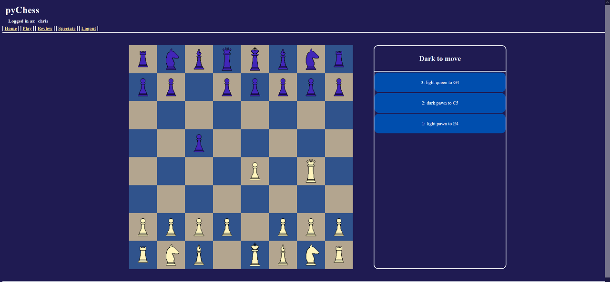

# PyChess

## What is it?

PyChess is a Django-based website prototype where you can go to play chess online with your friends.
After registering for an account you can start a game locally, with you and a friend sitting at the same computer,
or over the network by sharing your "Room Code" with your friend, where they can play from their own computer.
PyChess also includes the ability to review previously completed games turn-by-turn; and the ability to spectate games
currently in progress by other users; provided you have the room code.

## How does it work?

On a system with Python and Django installed, pyChess can be ran locally by navigating to the 'pyChess' directory
via command prompt and running `python manage.py runserver`. The user can then open a web browser and visit `https://127.0.0.1:8000/` to open the pyChess homepage.

The user can then create an account or login, and begin a game by clicking the `play` link in the top left corner. Note that network games will be restricted to the users
local network since the site is only hosted on the users local machine.

Pieces on the board can be moved via the mouse. A left click on a piece will highlight the spaces the piece can move, and another left click will either move the piece or cancel.

The server side of the code is written entirely in Python using the Django framework, and the client side is written entirely in raw JavaScript, HTML, and CSS.
The "Chess Engine" itself was written entirely by hand in raw Python.

When starting a new game, a call is made to the chess engine to create a new board.
The game state is created as a JSON object, which contains both players usernames, the games ID, and the current location of each piece on the board.
This JSON object is then passed back and forth between the server and client throughout the game via POST and fetch requests.
Each move made during the game is stored as a sqlite database entry, using Django's "Model" system.
The chess engine can then re-create the state of the game at any point by retrieving a list of all moves made that are associated with a specific game ID from the database.
Using this system, it's possible theoretically for two players in two different physical locations to play a single game together,
and for the game to be loaded back to its most recent state any time a user closes the window, without any loss of progress.

## Why did I make it?

pyChess was built as a final project for Harvard's online CS50 Web Development course. It was intentionally built using as few libraries and frameworks as possible, with the
exception of Django, as it was a required per the project guidelines. This was my first time attempting to build a site of this scale, and I wanted to use the opportunity to
familiarize myself more with CSS and raw JavaScript.